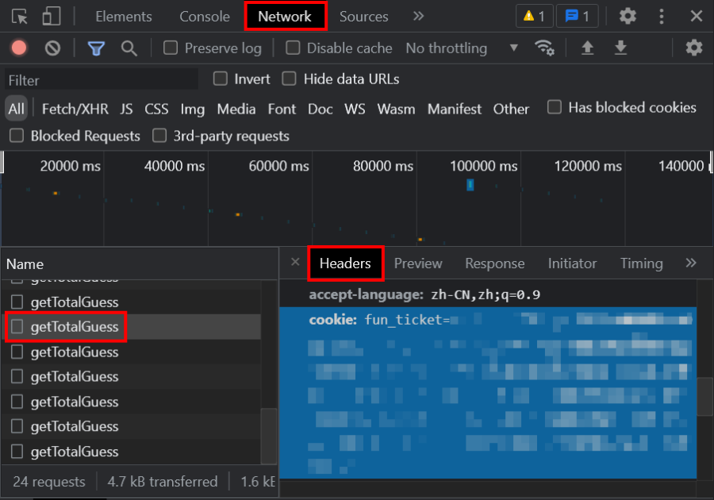

Tuxun-AI
==========
AI applications on Tuxun the GeoGuessor game  
利用人工智能识别图寻街景所在位置  **` v0.3 `**

<sup> This project only supports Chinese docs. If you are an English user, feel free to contact us. </sup>

-----
> **警告：**  
> - 在图寻 PVP 对局中使用此 AI 将影响游戏的公平性、损害其他玩家的游戏体验。
> - 在图寻的任何模式中 **滥用** 此 AI 均有可能导致图寻账户被封禁等严重后果。
> - 本项目不对此 AI 的准确度提供完全保证，也不对使用此 AI 导致的任何后果负责。


## 介绍 <sub>Intro</sub>
#### 实现的功能
程序可以通过用户所提供的 **图寻游戏对局的 ID**，获取到该街景图片并输入到已训练的模型中进行识别，然后返回该街景可能的拍摄位置。

- **已支持的图寻街景类型：**
    - **谷歌街景**（ API 域名 streetviewpixels-pa.googleapis.com ）
    - **炒饭街景**（ API 域名 map.chao-fan.com ，本质上也是谷歌街景）

    针对上述街景的预测 **精确到国家(地区)名**。  
    目前不支持中国大陆的省份级的识别，也就是说不支持百度街景。

- **已支持的图寻游戏模式：**
    - **连胜挑战**（仅限固定）
    - **匹配 Solo**


## 使用方法 <sub>Usage</sub>
#### 快速上手
1. 安装 [**Python 3**](https://www.python.org)（建议版本 3.8 及以上，已安装请跳过），并正确配置 PATH 环境变量。

2. 安装 PyTorch 依赖库。`Win+R` 运行 `cmd`，输入下方命令，回车运行：
    ```shell
    pip install torch torchvision -i https://mirrors.aliyun.com/pypi/simple
    ```

3. [打包下载](https://github.com/isHarryh/Tuxun-AI/archive/refs/heads/main.zip)本仓库的文件到本地，然后解压缩，进入解压后的文件夹。

4. 在 `cookie.txt` 文件中，输入你的图寻 **用户凭据 Cookie**。方法如下：
    1. 在浏览器登录图寻账户后，进入[图寻首页](https://tuxun.fun)，打开浏览器 “开发人员工具”（按键盘 `F12`）。

    2. 在 “开发人员工具” 中进入 “网络(Network)” 选项卡，在请求列表中，找到任意一个图寻 API 请求（通常名称以 `get` 开头）。

    3. 点击该请求，查看其 “标头(Headers)” ，向下浏览找到 `cookie` 字段，完整复制该字段后面的值。如图所示：

    4. 粘贴到程序文件夹中的 `cookie.txt` 文件内保存。

    > **注意：** 用户凭据 Cookie 需要被妥善保管，不应泄漏给他人，否则可能会对你的图寻账户安全造成风险。

5. 运行 `Main.py`，如果凭据配置正确，会提示 “输入图寻 GameID”；如果凭据配置失败，请重新参照上一步进行凭据配置。

6. 在浏览器中进入任意一局图寻游戏后，浏览器地址栏中的 `Id=` 后面的字符串（形如 `1234abcd-1234-abcd-5678-1234abcd5678`）就是图寻 GameID 。将这个 ID 粘贴到程序窗口中，按回车即可得到地点预测结果。如图所示：

    > **注意：** 预测程序给出的经纬度表示的是该国家(地区)的中心坐标，而不是街景所在地点的预测坐标。


## 模型概述 <sub>About Models</sub>
模型版本：`v0.3.0`

目前程序所使用的模型基于 [**MobileNetV3 Large**](https://pytorch.org/blog/torchvision-mobilenet-v3-implementation/#network-architecture) 神经网络架构。  
训练时，模型参数首先取预训练权重，对分类器层参数进行了若干次迭代。然后使用更小的学习率，对全部层参数进行迭代直到损失函数收敛。

模型的部分细节信息如下：

| 数据集 |  |
| :---- | :---- |
| 数据来源 | 谷歌街景 |
| 目标分类 | **180** 个国家(地区) |
| 训练集大小 | **26k** 个地点 / 52k 张图片 |
| 测试集大小 | **4k** 个地点 / 8k 张图片 |

| 模型训练 |  |
| :---- | :---- |
| 优化器 | Adam |
| 累计迭代 | 40 |
| 训练日期 | 2023-6-6 |

| 性能评估 |  |
| :---- | :---- |
| 第一准确率 (Acc@1) | **57.73%** |
| 前五准确率 (Acc@5) | 80.30% |

模型性能略有不足。模型训练所用的数据集、训练模型所用的代码暂不开源。


## 许可证 <sub>Licensing</sub>
本项目基于**BSD3协议**。任何人都可以自由地使用和修改项目内的源代码，前提是要在源代码或版权声明中保留作者说明和原有协议，且不可以使用本项目名称或作者名称进行宣传推广。
